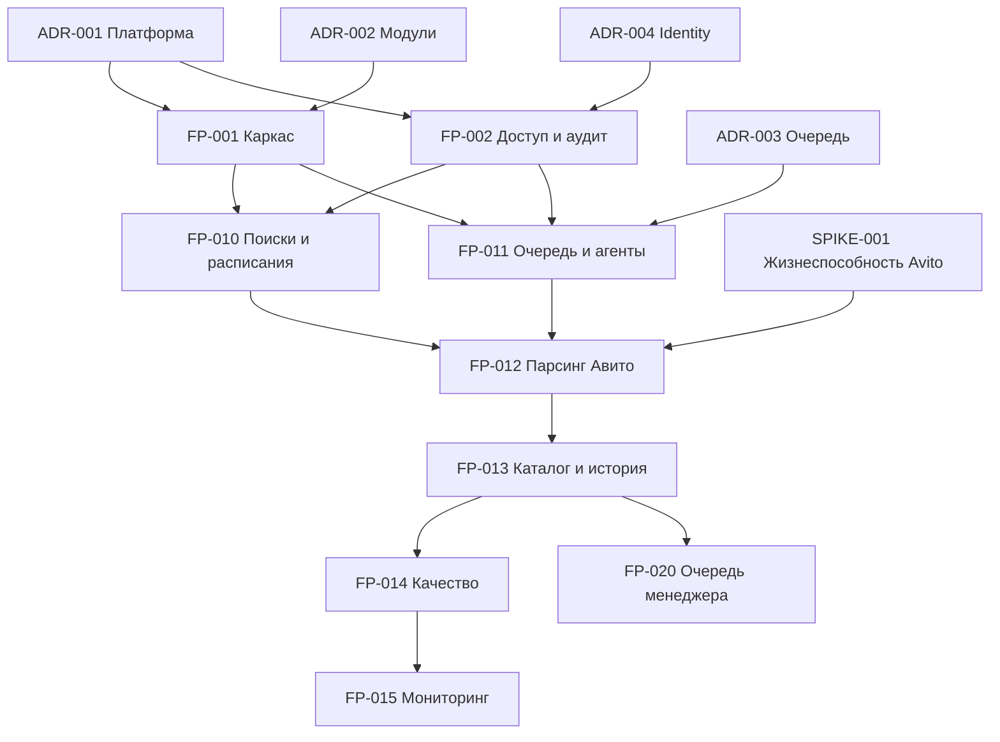

# Реестр планов Land ERP

**Версия:** 0.5  
**Дата:** 6 сентября 2026 года  
**Статус:** рабочий реестр  
**Главный документ:** `Генеральный_архитектурно-технический_план_Land_ERP.md`

## 1. Для чего нужен реестр

Реестр показывает, какие решения и планы нужны проекту, в каком порядке они
готовятся и от чего зависят. Он не заменяет планы и не превращает будущие идеи в
обязательный объём первой версии.

Основное правило: код по крупной возможности не начинается, пока её план не
получил статус `Утверждён`. Незначительные уточнения внутри уже утверждённого
решения оформляются в журнале плана, а изменение архитектуры — отдельным ADR.

## 2. Типы документов

| Код | Документ | Назначение |
|---|---|---|
| `MASTER` | Генеральный план | Архитектура, модули, этапы и общие границы продукта |
| `ADR` | Архитектурное решение | Один значимый выбор, альтернативы и последствия |
| `FP` | План фичи | Полное проектирование крупной пользовательской или системной возможности |
| `SPIKE` | Техническое исследование | Проверка критичной гипотезы до промышленной реализации |
| `TP` | План задачи | Один реализуемый вертикальный срез утверждённой фичи |
| `UX` | План интерфейса | Сквозной пользовательский поток или расширение дизайн-системы |
| `OP` | Операционный план | Развёртывание, обновление, восстановление и поддержка |

Статусы: `Не начат`, `Черновик`, `На согласовании`, `Утверждён`, `В реализации`,
`Реализован`, `Отложен`, `Заменён`.

## 3. Карта зависимостей первой реализации

Дизайн-система `FP-003` начинается вместе с каркасом и становится обязательной
зависимостью перед созданием полноценных рабочих экранов.

## 4. Волна 0 — фундамент проекта

Эти документы составляются и согласуются первыми.

| ID | Файл | Результат | Статус |
|---|---|---|---|
| `ADR-001` | `ADR-001_Платформа_и_версии.md` | Зафиксированы .NET/C#/EF/Npgsql/PostgreSQL, Windows x64 Agent и политика обновлений | Утверждён |
| `ADR-002` | `ADR-002_Структура_решения_и_границы_модулей.md` | Зафиксированы `LandErp`, проекты solution, зависимости и правила модулей | Утверждён |
| `ADR-003` | `ADR-003_Сохраняемая_очередь_PostgreSQL.md` | Обоснована PostgreSQL-очередь, аренды и критерии перехода к брокеру | Утверждён |
| `ADR-004` | `ADR-004_Аутентификация_и_машинная_идентичность.md` | Выбран способ входа сотрудников, инвесторов и агентов | Утверждён |
| `ADR-005` | `ADR-005_Хранилище_файлов.md` | Приняты `IFileStorage`, безопасный доступ и переносимость backend | Утверждён |
| `ADR-006` | `ADR-006_Политика_зависимостей_и_UI-база.md` | Приняты минимальные зависимости, локальный Bootstrap CSS и собственные компоненты | Утверждён |
| `FP-001` | `FP-001_Архитектурный_каркас_и_среды.md` | Воспроизводимый каркас Server/Worker/Agent и CI | Черновик |
| `FP-002` | `FP-002_Идентификация_роли_права_и_аудит.md` | Базовый безопасный доступ и журнал критичных действий | Черновик |
| `FP-003` | `FP-003_Единая_дизайн-система_ERP.md` | Общие компоненты и визуальные правила всех экранов | Черновик |
| `OP-001` | `OP-001_Локальная_среда_разработки.md` | Однозначный запуск проекта на рабочей машине | Черновик |
| `OP-002` | `OP-002_CI_CD_и_окружения.md` | Поставка Test/Staging/Production и миграции | Черновик |
| `OP-003` | `OP-003_Резервное_копирование_и_восстановление.md` | RPO/RTO, копии и проверка восстановления | Черновик |

### 4.1. Проверка критичной гипотезы до production-разработки

| ID | Файл | Результат | Зависимости | Статус |
|---|---|---|---|---|
| `SPIKE-001` | `SPIKE-001_Проверка_жизнеспособности_парсинга_Avito.md` | Измеримое решение `Go / Conditional Go / No-Go` по C# + Playwright до промышленной реализации Agent | ADR-001, ADR-006, FP-012 как целевой контракт | Черновик |
| `TP-SPIKE-001` | `TP-SPIKE-001_План_реализации_прототипа_Avito.md` | Последовательность из восьми изолированных Gate исследования | SPIKE-001 | Готов к поэтапному согласованию |
| `GATE-SPIKE-001-01` | `GATE-SPIKE-001-01_Каркас_и_контракты.md` | Минимальный solution, контракты, сериализация и тесты без live Avito | TP-SPIKE-001 | Готов к утверждению |

## 5. Волна 1 — первый сквозной сбор

| ID | План | Основной результат | Зависимости | Статус |
|---|---|---|---|---|
| `FP-010` | Поисковые ссылки, ревизии и расписания | Администратор создаёт и запускает одну поисковую конфигурацию | FP-001, FP-002 | Черновик |
| `FP-011` | Очередь заданий и локальные агенты | Сервер надёжно выдаёт задания одному агенту | FP-001, FP-002, ADR-003, ADR-004 | Черновик |
| `FP-012` | Парсинг Авито: выдача и карточка | Агент извлекает данные двух уровней и сообщает качество | SPIKE-001, FP-010, FP-011 | Черновик |
| `FP-013` | Каталог объявлений, наблюдения и дедупликация | История без дублей по `Source + ExternalId` | FP-012 | Черновик |
| `FP-014` | Контроль качества и диагностика источника | Ошибка разметки не создаёт ложные массовые изменения | FP-012, FP-013 | Черновик |
| `FP-015` | Административный мониторинг сбора | Администратор видит прогоны, ошибки и состояние агентов | FP-010–FP-014, FP-003 | Черновик |
| `OP-010` | Установка и обновление локального агента | Безопасное подключение 3–5 компьютеров | FP-011 | Черновик |
| `OP-011` | Инциденты источника и CAPTCHA | Понятная ручная реакция без скрытого обхода защиты | FP-014 | Черновик |

Ограниченный исследовательский код `SPIKE-001` допускается до построения серверного
контура и не считается production-кодом. Промышленный код первого пилота
начинается только после решения `Go / Conditional Go`, принятия его ограничений
и утверждения планов `FP-010`–`FP-013` и связанных ADR. Масштабирование до 30–50
ссылок и 3–5 компьютеров выполняется после проверки одного сквозного пути.

### 5.1. Первые технические планы задач

Подготовлен отдельный `LandErp_Development_Starter_Pack` с рабочими правилами Zoo
Code и десятью `TP`:

| ID | Результат | Статус |
|---|---|---|
| `TP-001` | Каркас solution | На согласовании |
| `TP-002` | SDK, сборка и зависимости | На согласовании |
| `TP-003` | PostgreSQL и миграции | На согласовании |
| `TP-004` | Quality gates и наблюдаемость | На согласовании |
| `TP-005` | Identity и каркас permissions | На согласовании |
| `TP-006` | Blazor shell и UI foundations | На согласовании |
| `TP-007` | Одна поисковая ссылка | На согласовании |
| `TP-008` | Регистрация одного Windows Agent | На согласовании |
| `TP-009` | Одно сохраняемое задание и lease | На согласовании |
| `TP-010` | Первая HTML-фикстура выдачи Авито | На согласовании |

Ни один из них не разрешает запись кода до явного изменения статуса владельцем.

## 6. Волна 2 — рабочее место менеджера

| ID | План | Основной результат | Статус |
|---|---|---|---|
| `FP-020` | Очередь решений менеджера | Объяснимая очередь новых и изменившихся объектов | Черновик |
| `FP-021` | Карточка объявления и реального объекта | Источники, история, подтверждения и противоречия в одном экране | Черновик |
| `FP-022` | Быстрые решения и причины | В работу, наблюдать, уточнить, отклонить | Черновик |
| `FP-023` | Наблюдение за ценой и повторным контактом | Возврат объекта по цене, дате или событию | Черновик |
| `FP-024` | Сопоставление объявлений с PropertyCase | Несколько объявлений связываются с реальным объектом | Черновик |
| `FP-025` | Комментарии, задачи, контакты и хронология | Командная работа без личных таблиц | Черновик |
| `FP-026` | Метрики менеджера и воронка | Измерение скорости и качества обработки | Черновик |

## 7. Волна 3 — проверки и экономика кандидата

| ID | План | Основной результат | Статус |
|---|---|---|---|
| `FP-030` | Каркас Due Diligence | Проверки, вопросы, доказательства и повторная оценка | Черновик |
| `FP-031` | Кадастровая и имущественная проверка | Структурированные сведения без ложного флага «чисто» | Черновик |
| `FP-032` | Градостроительная проверка | Генплан, ПЗЗ, зоны и планы окружения | Черновик |
| `FP-033` | Подъезд и техническое состояние | Фактический/правовой доступ, грунт, вода, мусор, строения | Черновик |
| `FP-034` | Проверка возможности раздела | Исходные и целевые лоты, инфраструктура и ограничения | Черновик |
| `FP-035` | Рыночные аналоги | Сопоставимые предложения с происхождением данных | Черновик |
| `FP-036` | Предварительная экономика и лимит покупки | Сценарии, капитал, сроки и чувствительность | Черновик |

## 8. Волна 4 — сделка и реализация проекта

| ID | План | Основной результат | Статус |
|---|---|---|---|
| `FP-040` | Переговоры и история цен | Запрос продавца, предложение и лимит разделены | Черновик |
| `FP-041` | Покупка и создание InvestmentProject | Кандидат становится реальным проектом | Черновик |
| `FP-042` | Сценарии и версии бюджета | Черновик, утверждение и plan–fact | Черновик |
| `FP-043` | Работы и подрядчики | Расчистка, демонтаж, дорога и другие работы | Черновик |
| `FP-044` | Преобразование участков и инфраструктура | Несколько исходных объектов и результирующих лотов | Черновик |
| `FP-045` | Подготовка лотов к продаже | Материалы, цены, публикации и статусы | Черновик |
| `FP-046` | Продажи и закрытие проекта | Поступления, расходы, результат и закрытие | Черновик |

## 9. Волна 5 — лёгкий кабинет инвестора

Кабинет можно начать после появления контролируемой модели проекта и финансов.
Проектную изоляцию доступа необходимо заложить уже в `FP-002`.

| ID | План | Основной результат | Статус |
|---|---|---|---|
| `FP-050` | Профиль, приглашение и вход инвестора | Безопасный доступ внешнего пользователя | Черновик |
| `FP-051` | Проектные права инвестора | Только назначенные проекты и разрешённые разделы | Черновик |
| `FP-052` | Портфель и карточка проекта | Стадия, события, фото и plan–fact | Черновик |
| `FP-053` | Участие и финансовые события | Вклад, распределение и выплата с понятным статусом | Черновик |
| `FP-054` | Публикация документов и отчётов | Версии, автор, дата и отзыв публикации | Черновик |
| `FP-055` | Обращения инвестора | Вопрос, ответственный, ответ и история | Черновик |
| `FP-056` | Юридическая проверка кабинета | Разрешённые формулировки, данные и документы | Черновик |

## 10. Последующее развитие

| ID | План | Условие начала | Статус документа |
|---|---|---|---|
| `FP-060` | PostGIS и геомодель | Появились подтверждённые координаты и сценарии карты | Черновик |
| `FP-061` | Карта объектов и ограничений | Утверждены геоданные и UX-сценарии | Черновик |
| `FP-062` | Пространственный поиск и окружение | Доступны качественные геометрии | Черновик |
| `FP-063` | Второй источник объявлений | Первый адаптер стабилен и измерен | Черновик |
| `FP-064` | ИИ-извлечение и подсказки | Есть контрольный набор и процесс проверки человеком | Черновик |
| `FP-070` | Сообщения продавцам | Подтверждены допустимый канал, аудит и ручное согласование | Черновик |
| `FP-071` | Расширенная аналитика директора | Накоплены качественные операционные данные | Черновик |

## 11. Что составлено сейчас

- настоящий реестр;
- единый шаблон плана фичи;
- утверждённые `ADR-001`–`ADR-006` по платформе, модулям, очереди, identity,
  файлам, зависимостям и UI-базе;
- черновик `FP-001` по архитектурному каркасу и средам;
- черновик `FP-002` по идентификации, ролям, правам и аудиту;
- черновик `FP-003` по единой дизайн-системе ERP.
- черновик `FP-010` по поисковым ссылкам, ревизиям и расписаниям;
- черновик `FP-011` по очереди заданий и локальным агентам;
- черновик `FP-012` по двухуровневому адаптеру Авито;
- черновик `FP-013` по каталогу, истории и дедупликации.
- черновики `OP-001`–`OP-003` по локальной среде, CI/CD и восстановлению;
- черновик `FP-014` по контролю качества и диагностике источника;
- черновик `FP-015` по административному мониторингу;
- черновик `FP-020` по очереди решений менеджера.
- черновики `OP-010` и `OP-011` по установке Agent и инцидентам источника;
- черновик `SPIKE-001` по проверке жизнеспособности C# + Playwright на Avito до
  промышленной реализации Agent;
- черновики `FP-021`–`FP-026` по рабочему месту менеджера;
- черновики `FP-030`–`FP-036` по due diligence и экономике кандидата;
- черновики `FP-040`–`FP-046` по сделке, работам, лотам и закрытию проекта;
- черновики `FP-050`–`FP-056` по лёгкому кабинету инвестора;
- отложенные черновики `FP-060`–`FP-064`, `FP-070`–`FP-071` по геоданным,
  второму источнику, ИИ, коммуникациям и аналитике директора.
- стартовый комплект Zoo Code и `TP-001`–`TP-010` для первого вертикального пути.

Реестр полностью покрыт документами, а фундаментальные ADR утверждены. Следующий
шаг — согласовать первый сквозной набор `FP-001`, `FP-002`, `FP-003`,
`FP-010`–`FP-015`, `FP-020`. Только
утверждённые планы раскладываются на конкретные вертикальные `TP`. Наличие
черновика дальнейшей волны не означает разрешение начинать её реализацию.

## 12. Правило актуализации

- При создании плана добавлять файл и статус в этот реестр.
- При замене решения не удалять старый документ; пометить `Заменён` и дать ссылку.
- Не считать план реализованным только по факту наличия кода.
- Не создавать план «на всякий случай», если его реализация не приближается.
- Один ответственный актуализирует статус после согласования и после реализации.
