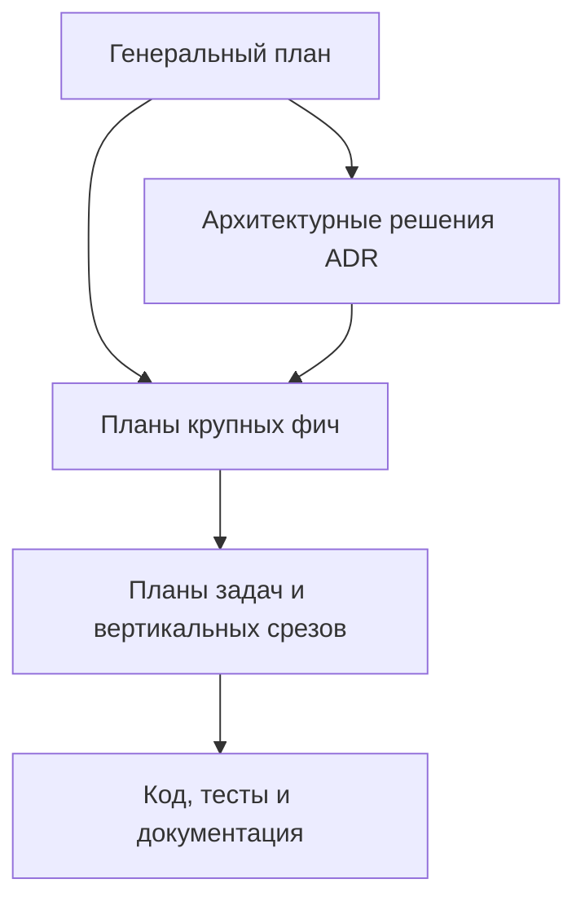
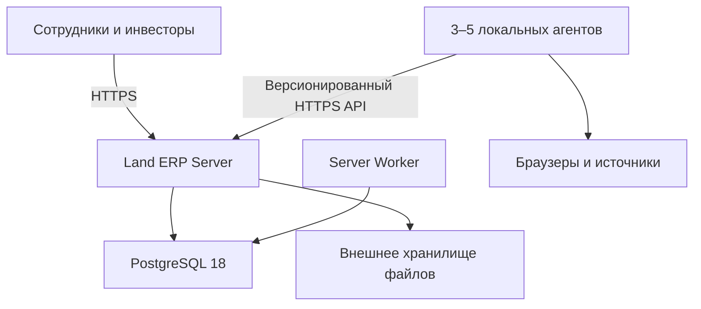
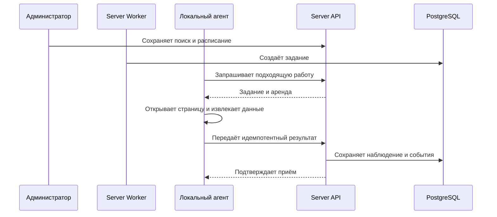

# Генеральный архитектурно-технический план Land ERP

**Версия:** 0.5  
**Дата:** 6 сентября 2026 года  
**Статус:** согласованное архитектурное направление  
**Аудитория:** владелец продукта, директор, аналитики, архитекторы и разработчики

---

## 1. Назначение документа

Этот документ является верхним техническим планом облачной ERP для поиска,
проверки, приобретения, подготовки, раздела и перепродажи земельных участков.
Он задаёт устойчивые границы системы, принципы архитектуры, состав модулей,
модель данных, безопасность, эксплуатацию и порядок развития.

Генеральный план не является подробным техническим заданием отдельной фичи и не
содержит примеров кода. После его согласования каждая крупная возможность будет
получать собственный план реализации с пользовательскими сценариями, контрактами,
макетами, тестами, этапами и примерами кода единого архитектурного и визуального
стиля.

### 1.1. Что этот документ должен обеспечить

- Один источник архитектурной правды для всей команды.
- Возможность добавлять функции ERP без разрушения уже реализованных модулей.
- Единый путь объявления от обнаружения до бизнес-проекта и расчётов.
- Надёжную работу 3–5 локальных компьютеров-сборщиков под управлением сервера.
- Разделение прав сотрудников и инвесторов.
- Историчность данных, финансов и решений.
- Понятную структуру будущих планов, задач и архитектурных решений.

### 1.2. Что не входит в этот документ

- Детальные требования каждого экрана.
- Полный состав полей карточки объявления.
- Конкретные CSS-селекторы площадок.
- Реализация юридических и кадастровых интеграций.
- Примеры C#, SQL, TypeScript и Razor-кода.
- Оценка трудоёмкости в часах и распределение задач между разработчиками.

---

## 2. Система планирования реализации

Вся проектная документация строится сверху вниз. Нижний документ уточняет верхний,
но не может незаметно менять принятое архитектурное решение.

### 2.1. Виды документов

| Уровень | Назначение | Когда изменяется |
|---|---|---|
| Генеральный план | Границы продукта, архитектура, модули, этапы и общие правила | При существенном изменении направления системы |
| ADR | Одно значимое архитектурное решение, варианты и последствия | При принятии или замене трудно обратимого решения |
| План фичи | Полное проектирование крупной возможности | До начала её реализации и по факту уточнений |
| План задачи | Конкретный проверяемый вертикальный объём работы | Перед реализацией отдельного шага фичи |
| Операционная инструкция | Запуск, развёртывание, восстановление, поддержка | При изменении среды или процесса эксплуатации |
| Журнал решений | Краткая хронология утверждений и изменений | После каждого согласованного решения |

### 2.2. Предлагаемая структура документации

- `docs/00-master` — генеральный план и реестр документации.
- `docs/01-decisions` — ADR.
- `docs/02-feature-plans` — планы крупных возможностей.
- `docs/03-task-plans` — планы конкретных вертикальных задач.
- `docs/04-ux` — визуальная система, макеты, пользовательские потоки.
- `docs/05-operations` — среды, развёртывание, резервные копии и поддержка.
- `docs/06-quality` — стратегия тестирования, контрольные наборы и отчёты качества.

Папки и правила именования будут окончательно зафиксированы при создании
репозитория. До этого черновики ведутся в плоском реестре, а `TP` не создаются
раньше утверждения соответствующего плана фичи.

### 2.3. Идентификация и статусы

- Архитектурные решения: `ADR-NNN`.
- Планы фич: `FP-NNN`.
- Планы задач: `TP-NNN`.
- Статусы: `Черновик`, `На согласовании`, `Утверждён`, `В реализации`,
  `Реализован`, `Заменён`, `Отложен`.
- Каждый документ содержит владельца решения, дату, версию, зависимости и ссылки
  на документы верхнего уровня.

---

## 3. Цели и границы продукта

### 3.1. Главная бизнес-цель

Увеличить количество качественно рассмотренных рыночных предложений на одного
менеджера, сохранить историю рынка и постепенно объединить поиск, проверки,
экономику, реализацию проектов и взаимодействие с инвесторами в одной ERP.

### 3.2. Основной жизненный цикл объекта

1. Обнаружение объявления в одной или нескольких поисковых выдачах.
2. Первичная автоматическая обработка и постановка в очередь менеджера.
3. Решение: взять в работу, наблюдать, уточнить или отклонить.
4. Сбор недостающих сведений и контакт с продавцом.
5. Юридические, кадастровые, градостроительные, технические и рыночные проверки.
6. Формирование сценария, экономики, лимита покупки и переговоров.
7. Покупка и создание реального инвестиционного проекта.
8. Расчистка, демонтаж, дорога, выравнивание, раздел и другие работы.
9. Формирование лотов, маркетинговая подготовка и продажа.
10. Учёт поступлений, результата проекта и расчётов с инвесторами.

### 3.3. Первая измеримая ценность

Первая версия должна доказать не способность открыть много страниц, а способность
снизить ручную работу менеджера без потери объявлений и доверия к данным.

Основные показатели первой версии:

- полнота контрольного поиска;
- доля корректно извлечённых ключевых полей;
- доля дублей и ложных изменений;
- время от появления объявления до решения менеджера;
- количество качественных решений менеджера за рабочий день;
- доля объектов, возвращённых в работу по сигналу цены или дате контакта;
- доступность агентов и возраст очереди заданий.

### 3.4. Принятые ограничения первого контура

- 30–50 вручную созданных ссылок поиска.
- Авито как первый адаптер; Циан или другой допустимый источник позже.
- Два уровня сбора: выдача и подробная карточка.
- 3–5 локальных компьютеров с браузерными агентами.
- Централизованные настройки и расписания в облачной ERP.
- Возможность ручного добавления объявления или объекта по ссылке.
- Отсутствие автоматической отправки сообщений продавцам.
- PostGIS предусмотрен, но не является условием запуска первой версии.

### 3.5. Продуктовые ограничения

В первой очереди не строятся:

- публичная инвестиционная витрина;
- автоматический приём, хранение или вывод денежных средств;
- электронное подписание инвестиционных договоров;
- вторичный оборот долей;
- полностью автоматическое юридическое заключение;
- автоматическое признание объекта «юридически чистым»;
- обход CAPTCHA, блокировок и технических ограничений источников;
- микросервисная инфраструктура без измеренной необходимости;
- тяжёлая геоаналитика до накопления качественных координат и сценариев.

---

## 4. Архитектурные принципы

### 4.1. Польза раньше масштаба

Сначала создаётся один сквозной вертикальный путь: поисковая ссылка, серверное
задание, один агент, выдача, подробная карточка, база и очередь менеджера. Только
после измерения этого пути система масштабируется на десятки поисков и несколько
компьютеров.

### 4.2. Модульный монолит

Серверная ERP начинается как модульный монолит с явными доменными границами.
Единое приложение уменьшает операционную сложность, но модули не получают право
произвольно обращаться к внутренним данным друг друга.

Микросервис выделяется только при наличии подтверждённой причины: независимое
масштабирование, отдельная модель отказа, особые требования безопасности или
организационно независимая команда. Выделение оформляется ADR.

### 4.3. Вертикальные срезы

Код группируется вокруг пользовательских и системных сценариев, а не вокруг
глобальных технических слоёв. Срез включает вход, проверку прав, валидацию,
бизнес-логику, данные, результат, наблюдаемость и тесты конкретного Use Case.

### 4.4. История важнее текущего снимка

Цена, доступность, параметры объявления, подтверждённые сведения, бюджет и
публикации для инвесторов должны иметь историю. Новое чтение не должно стирать
то, что система знала раньше.

### 4.5. Неизвестное не равно отрицательному

Отсутствующий кадастровый номер, неизвестный подъезд или неполная карточка не
означают автоматически плохой объект. Система должна выделить неопределённость и
создать понятный следующий шаг.

### 4.6. Сервер управляет, агент исполняет

Все поиски, расписания, приоритеты, ограничения и права задаются сервером. Агент
выполняет только структурированные задания, не принимает бизнес-решения и не имеет
доступа к базе ERP.

### 4.7. Прогноз не является фактом

Исходные данные, допущения, сценарии, согласованные значения и фактические события
разделяются в данных, API и интерфейсе. Это особенно важно для экономики проекта
и кабинета инвестора.

### 4.8. Безопасность на сервере

UI может скрывать недоступные действия, но каждое право и область данных
проверяются сервером. Обладание идентификатором проекта или файла не даёт доступа.

### 4.9. Допустимый способ получения данных

Каждый источник подключается только через юридически и технически допустимый
канал: официальный API, договорный/лицензированный доступ, разрешённую браузерную
автоматизацию либо ручной ввод. Система не проектируется для обхода защит площадок.

---

## 5. Контекст и топология системы

### 5.1. Land ERP Server

- Blazor Web App для сотрудников и инвесторов.
- HTTP API для пользовательских сценариев и агентов.
- Аутентификация, авторизация, аудит и управление файлами.
- Модульная прикладная логика.
- Административный интерфейс поисков, расписаний и агентов.

### 5.2. Server Worker

- Материализация расписаний в задания.
- Выдача и возврат аренд заданий.
- Обработка результатов сбора.
- Расчёт уведомлений, наблюдений и повторных проверок.
- Фоновые отчёты, очистка по политике хранения и технические процессы.

Worker разворачивается отдельно от веб-процесса, но использует те же прикладные
модули и базу данных. Это не отдельный микросервис.

### 5.3. Локальный Agent

- Регистрируется как машинная учётная запись.
- Сообщает версию, возможности, состояние и heartbeat.
- Получает подходящее задание с ограниченной арендой.
- Запускает браузер в управляемом профиле.
- Извлекает данные адаптером конкретного источника.
- Сохраняет неподтверждённый результат в локальный SQLite outbox.
- Повторяет доставку до подтверждения сервера.
- Переходит в состояние внимания при CAPTCHA, авторизации или нетипичной странице.

### 5.4. PostgreSQL

- Основные транзакционные данные ERP.
- История наблюдений объявлений.
- Сохраняемая очередь, аренды и идемпотентность заданий.
- Аудит бизнес-изменений.
- Read models для рабочих очередей и отчётности.

### 5.5. Хранилище файлов

Фотографии, документы, отчёты, диагностические скриншоты и иные бинарные материалы
хранятся вне основных таблиц PostgreSQL. В БД находятся метаданные, контрольная
сумма, категория, владелец, версия, права, статус публикации и ссылка на объект.

---

## 6. Границы модулей ERP

| Модуль | Ответственность | Не должен владеть |
|---|---|---|
| IdentityAccess | Пользователи, роли, разрешения, области доступа, сессии | Бизнес-статусы объектов и проектов |
| Administration | Системные настройки, источники, расписания, агенты, лимиты, kill switch | Извлечение полей конкретной площадки |
| Collection | Поиски, ревизии, задания, запуски, результаты, наблюдения, диагностика | Решения менеджера и экономика сделки |
| PropertyCatalog | Объявления, реальные объекты, участки, строения, связи и история сведений | Планировщик заданий и права инвесторов |
| ManagerWorkspace | Очередь решений, действия, комментарии, задачи, контакты, наблюдение | Юридические заключения и движения денег |
| DueDiligence | Проверки, вопросы, доказательства, выводы и ограничения | Автоматическое объявление объекта чистым |
| ProjectsFinance | Сделка, сценарии, бюджет, работы, раздел, лоты, продажи, капитал | Аутентификация и технический парсинг |
| InvestorPortal | Участие, проектный доступ, публикации, отчёты, обращения | Черновые внутренние расчёты по умолчанию |
| Reporting | Согласованные показатели и read models | Изменение первичных бизнес-данных |

### 6.1. Правило владения данными

Каждая таблица и каждое бизнес-событие имеют одного владельца-модуль. Другой
модуль получает данные через публичный прикладной контракт, событие или специально
подготовленную read model. Прямое использование внутренних entity и handler чужого
модуля запрещается архитектурными тестами.

### 6.2. События внутри монолита

Доменные и прикладные события применяются для слабой связи модулей. Если событие
запускает необратимое внешнее действие, оно должно пройти через transactional
outbox. Внутрипроцессное событие не считается гарантированно доставленным после
успешного завершения HTTP-запроса без сохраняемого механизма.

### 6.3. Shared Kernel

Общая область должна быть минимальной: идентификаторы, время, денежная сумма,
валюта, единицы измерения, базовые результаты операции и технические абстракции.
Доменные сущности, статусы и универсальные «helper»-классы туда не помещаются.

---

## 7. Генеральная структура решения

Предварительная структура проектов:

| Проект | Назначение |
|---|---|
| `LandErp.Server` | Веб-хост, Blazor, API, аутентификация и композиция приложения |
| `LandErp.Application` | Доменные модули, вертикальные срезы и публичные контракты модулей |
| `LandErp.Infrastructure` | EF Core, PostgreSQL, файлы, внешние сервисы и адаптеры инфраструктуры |
| `LandErp.Worker` | Фоновые задания, планировщик и исполнители очередей |
| `LandErp.Agent` | Локальное браузерное приложение |
| `LandErp.AgentContracts` | Минимальные версионированные DTO сервер–агент |
| `LandErp.Tests.*` | Unit, integration, architecture, contract и E2E tests |

Внутри `LandErp.Application` основная группировка выполняется по модулям и Use
Case. Имя solution и корневой namespace зафиксированы как `LandErp`. Точная
физическая структура и правила ссылок между проектами проверяются
архитектурными тестами по ADR-002.

---

## 8. Технологический фундамент

### 8.1. Принятая версия платформы

Для нового проекта принято:

- .NET 10 LTS и C# 14;
- ASP.NET Core 10 и Blazor Web App;
- EF Core 10 и совместимая основная версия Npgsql;
- PostgreSQL 18 на актуальном minor-релизе;
- Microsoft.Playwright для агента и E2E-тестов;
- TypeScript только для изолированных браузерных и визуальных модулей, когда
  Blazor и нативного HTML недостаточно.

Первоначально обсуждавшийся .NET 9 отклонён для нового репозитория. На дату
документа он находится в завершающей фазе поддержки, а окончание поддержки
назначено на 10 ноября 2026 года. .NET 10 является LTS и поддерживается до
14 ноября 2028 года. Решение закреплено ADR-001.

### 8.2. PostgreSQL 18

PostgreSQL 18 подходит для основной транзакционной системы, истории наблюдений и
первой сохраняемой очереди. Используется актуальный minor-релиз ветки 18. Major-
обновления выполняются отдельно от продуктовых фич.

### 8.3. PostGIS

PostGIS можно установить в инфраструктуре заранее, но первый рабочий контур не
должен зависеть от сложных пространственных функций. Координаты и происхождение
геоданных должны сохраняться так, чтобы позже перейти к:

- точкам объявлений и участков;
- геометрии кадастровых границ;
- поиску в полигонах и буферах;
- расстояниям до дорог и инфраструктуры;
- пространственным ограничениям и наложениям;
- анализу окружения.

Стандарт исходных GPS-координат — WGS 84 / SRID 4326, если последующий ADR не
установит иной стандарт. Для метрических расчётов должна применяться подходящая
проекция или корректная географическая модель, а не градусы как метры.

### 8.4. TypeScript

TypeScript не дублирует бизнес-логику ERP. Он применяется для:

- внутренней части браузерной автоматизации, если это необходимо;
- сложных карт и геовизуализации;
- графиков или интерактивных компонентов с недостаточным Blazor API;
- чётко ограниченных JS interop-модулей.

TypeScript и npm toolchain не включаются в первый контур, пока не появится такой
реальный сценарий.

### 8.5. Библиотеки и зависимости

- Версии централизованно закрепляются.
- Major-обновление выполняется отдельным планом.
- Новая зависимость требует владельца, назначения, лицензии и оценки поддержки.
- Для критичной инфраструктуры предпочтительны официальные или зрелые решения.
- Связанные версии EF Core и Npgsql согласуются по major.
- Сначала используются возможности платформы; пакеты не добавляются «на будущее».
- UI использует локальный Bootstrap CSS из шаблона Blazor и собственные
  компоненты/токены Land ERP; готовая Blazor component library и Bootstrap JS в
  первый контур не входят.
- Политика допуска и перечень отложенных зависимостей определены ADR-006.

### 8.6. Целевая ОС Agent

Первый поддерживаемый и тестируемый пакет `LandErp.Agent` выпускается для Windows
x64. Общая логика и протокол остаются переносимыми, а защищённое хранилище,
автозапуск, пути и установщик изолируются за ОС-специфичными интерфейсами.
Linux/macOS не входят в первую матрицу поставки.

---

## 9. Архитектура сбора данных

### 9.1. Поисковая конфигурация

Администратор сохраняет готовую URL-ссылку с выбранной территорией и фильтрами.
Система не пытается на первом этапе автоматически конструировать все параметры
поиска. Для каждой конфигурации хранятся:

- название и источник;
- URL без секретов;
- назначение и территория в понятном менеджеру виде;
- активность и приоритет;
- группа расписания и временная зона;
- допустимые агенты или необходимые capabilities;
- уровень первого прохода;
- лимиты страниц, времени и повторов;
- дата последнего успешного запуска;
- автор и история изменений.

Любое изменение значимых параметров создаёт новую ревизию поиска. Задание ссылается
на конкретную ревизию, чтобы результат можно было воспроизвести и объяснить.

### 9.2. Два уровня сбора

| Уровень | Цель | Типичные данные |
|---|---|---|
| Выдача | Быстро обнаружить новые и изменившиеся объявления | Source ID, URL, заголовок, цена, площадь, адрес, дата, краткий текст, продавец, превью |
| Карточка | Получить полное наблюдение интересного или нового объекта | Описание, параметры, координаты, фотографии, кадастровые номера, продавец, доступность и дополнительные признаки |

Выдача создаёт кандидатов и ценовые сигналы. Подробная карточка выполняется по
отдельной очереди, чтобы большой первичный сбор не блокировал новые объявления и
объекты в работе.

### 9.3. Поток задания

### 9.4. Аренда и повторная доставка

- Задание имеет состояние, приоритет, число попыток и срок доступности.
- Агент получает задание на ограниченное время.
- Heartbeat продлевает аренду в допустимых пределах.
- Потеря агента возвращает задание в очередь.
- Одинаковый результат может быть доставлен повторно без создания дублей.
- Запоздавший результат не должен откатывать более новое наблюдение.
- Ручной запуск и критичная проверка имеют приоритет над первичным наполнением.

### 9.5. Локальный outbox

Агент сначала надёжно записывает извлечённый результат в SQLite, затем отправляет
его серверу. Локальная запись удаляется только после подтверждения. Это защищает
от потери данных при временном отсутствии сети или перезапуске приложения.

### 9.6. Состояния агента

- `Offline` — heartbeat отсутствует.
- `Idle` — доступен для задания.
- `Busy` — выполняет задание.
- `Paused` — временно не принимает задания.
- `Draining` — завершает текущую работу перед остановкой.
- `AttentionRequired` — требуется действие человека.
- `Revoked` — сервер запретил дальнейшую работу.

Причина состояния и последнее диагностическое событие доступны администратору.

### 9.7. Адаптер источника

Адаптер скрывает от домена конкретную разметку площадки. Он содержит:

- проверку типа и состояния страницы;
- извлечение списка карточек;
- извлечение подробной карточки;
- нормализацию только технических форматов;
- диагностические коды и признак качества;
- набор тестовых HTML-фикстур;
- версию контракта извлечения.

Изменение адаптера не должно требовать изменения основной модели очереди,
менеджерского интерфейса или проекта сделки.

### 9.8. Защита от ложных данных

- Рекомендации и рекламные блоки отделяются от основной выдачи.
- Объявления другого города сохраняют происхождение и не смешиваются с основной
  контрольной выборкой.
- Количество в заголовке страницы не считается количеством успешно прочитанных
  карточек.
- Сортировка «по дате» проверяется перекрытием и контрольными проходами.
- Заголовок, параметры и описание сохраняются отдельно при противоречии.
- Пустая или нетипичная страница не означает массовое снятие объявлений.
- Резкое снижение полноты полей останавливает источник и создаёт инцидент.

### 9.9. CAPTCHA и ограничения площадки

Агент не пытается скрытно обходить защиту. При CAPTCHA, запросе авторизации,
блокировке или неизвестной странице он сохраняет безопасную диагностику,
освобождает либо удерживает задание по правилам и переводит источник или агента в
состояние внимания. Администратор принимает дальнейшее решение.

---

## 10. Концептуальная модель данных

### 10.1. Разделение ключевых понятий

| Понятие | Смысл |
|---|---|
| Listing | Объявление на конкретной площадке |
| ListingObservation | Неизменяемый результат одного чтения объявления |
| SearchDefinition | Сохранённая конфигурация поиска |
| SearchRevision | Версия конфигурации, по которой создан запуск |
| SearchRun | Один фактический проход поиска |
| ListingSearchMatch | Факт появления объявления в конкретном поиске/запуске |
| PropertyCase | Реальный объект или кандидат, рассматриваемый бизнесом |
| Parcel | Земельный участок как часть реального объекта |
| Building | Строение, связанное с объектом или участком |
| FieldAssertion | Утверждение о значимом поле с источником и уровнем доверия |
| Evidence | Документ, ссылка, снимок или иной материал проверки |
| InvestmentProject | Реальный проект после принятия решения/покупки |
| SaleLot | Подготовленный к продаже лот |

### 10.2. Почему объявление не равно объекту

Один реальный объект может публиковаться повторно, на разных площадках, разными
посредниками или частями. В то же время одно объявление может описывать несколько
участков. Поэтому связь между `Listing` и `PropertyCase` является явной и может
уточняться менеджером.

### 10.3. Наблюдения и актуальное представление

Каждое чтение создаёт `ListingObservation`. Для быстрого интерфейса система может
иметь вычисленное актуальное представление объявления, но оно всегда выводится из
истории и не заменяет её.

Наблюдение содержит:

- время чтения и время получения сервером;
- уровень: выдача или карточка;
- версию агента и адаптера;
- исходные и нормализованные значения;
- перечень присутствовавших полей;
- качество и диагностические коды;
- ссылку на поисковый запуск и задание;
- контрольную сумму значимых данных.

### 10.4. Утверждения и подтверждения

Для критичных сведений следует различать:

- заявление продавца;
- значение, извлечённое из площадки;
- автоматический вывод системы;
- ручное подтверждение менеджера;
- вывод профильного специалиста;
- факт из официального документа.

`FieldAssertion` позволяет хранить несколько утверждений, их происхождение,
актуальность и противоречия без преждевременного сведения к одному полю.

### 10.5. Не использовать универсальный EAV

Ключевые поля поиска, фильтрации, экономики, доступа и отчётности должны быть
типизированы. Универсальная модель «поле–значение» не должна заменять основную
схему. JSONB используется для версионированных специфичных полей источника и
диагностики, но не как единственное хранилище бизнес-данных.

### 10.6. Идентификаторы и время

- Внутренние бизнес-ID — UUIDv7, если ADR не установит исключение.
- Внешний ID хранится вместе с источником и не используется как глобальный ключ.
- Время — `DateTimeOffset` и `timestamptz`.
- Дата площадки и дата первого обнаружения системой различаются.
- Все интервалы и расписания имеют явную временную зону.

### 10.7. Деньги и измерения

- Денежное значение состоит из суммы и валюты.
- Расчёты выполняются в `decimal`/`numeric`.
- Площадь хранит значение и единицу; каноническая единица определяется отдельно.
- Исходное текстовое значение сохраняется рядом с нормализованным наблюдением.
- Правила округления задаются для конкретного расчёта.

---

## 11. Состояния и переходы

Один общий статус не способен корректно описать объект. Используются независимые
измерения состояния.

### 11.1. Доступность объявления

- активно;
- временно недоступно;
- снято по подтверждённому ответу источника;
- доступность не проверена;
- состояние страницы неизвестно.

### 11.2. Качество последнего сбора

- полно;
- частично;
- противоречиво;
- ошибка извлечения;
- требуется внимание;
- не выполнялось.

### 11.3. Интерес бизнеса

- новое;
- в работе;
- наблюдение;
- требуется уточнение;
- отклонено;
- связано с купленным проектом.

### 11.4. Стадия проверки

- не начата;
- формируется перечень вопросов;
- выполняется;
- есть нерешённые вопросы;
- завершена с выводом;
- требуется повторная оценка.

### 11.5. Стадия проекта

- подготовка сделки;
- переговоры;
- покупка;
- подготовительные работы;
- межевание/раздел;
- подготовка продаж;
- продажи;
- расчёты и закрытие;
- завершён;
- приостановлен или отменён.

### 11.6. Публикация для инвестора

- внутренний черновик;
- готово к проверке;
- опубликовано;
- заменено новой версией;
- отозвано с сохранением истории.

Переход выполняется отдельной командой, проверяет права и предусловия и создаёт
аудит. Изменение нескольких измерений одним действием допустимо только как явно
описанный бизнес-сценарий.

---

## 12. Рабочее место менеджера

### 12.1. Очередь действий

Главный экран менеджера показывает не бесконечный каталог, а очередь объектов с
причиной появления:

- новое объявление;
- существенное изменение цены;
- наступила дата повторного контакта;
- найдено повторное объявление;
- получена подробная карточка;
- обнаружено противоречие;
- требуется ручное уточнение;
- завершена назначенная проверка.

### 12.2. Быстрые решения

- взять в работу;
- наблюдать;
- уточнить;
- отклонить.

Каждое решение фиксирует автора, время, причину и следующий шаг. Отклонение не
удаляет историю и может иметь срок пересмотра.

### 12.3. Наблюдение

Наблюдение содержит условие возврата:

- цена достигла целевого значения;
- цена снизилась на заданную величину;
- наступила дата контакта;
- появилось новое объявление того же объекта;
- получен отсутствующий документ;
- изменился значимый параметр.

Сигнал создаёт действие менеджеру, а не отправляет сообщение продавцу.

### 12.4. Карточка объекта

Карточка объединяет, но визуально различает:

- исходные объявления и их историю;
- предполагаемый реальный объект;
- подтверждённые и спорные сведения;
- комментарии и контакты;
- проверки и доказательства;
- сценарии заработка;
- экономику и лимит покупки;
- задачи и хронологию решений.

Детальная структура экрана будет спроектирована отдельным планом фичи.

---

## 13. Проверки и доказательства

### 13.1. Направления проверки

- права, собственники, основания и обременения;
- границы, площадь, кадастровые сведения и строения;
- генплан, ПЗЗ, территориальная зона и регламенты;
- красные линии, зоны с особыми условиями и окружение;
- фактический и юридический доступ к участку;
- грунт, вода, рельеф, отходы, деревья и сезонность;
- допустимость раздела и конфигурация будущих лотов;
- рынок и сопоставимые предложения;
- экономика подготовки и реализации.

### 13.2. Результат отдельной проверки

- что проверялось;
- кто и когда проверял;
- использованный источник или документ;
- установленный факт или вывод;
- уровень подтверждения;
- обнаруженная проблема;
- нерешённый вопрос;
- срок актуальности и необходимость повторной проверки.

### 13.3. Запрет ложной автоматизации

Система может подготовить сведения, отметить противоречия и сформировать вопросы,
но не должна автоматически объявлять объект юридически чистым. Финальный вывод
остаётся у ответственного специалиста и имеет доказательную базу.

---

## 14. Проекты, экономика и финансовая модель

### 14.1. Переход от кандидата к проекту

`PropertyCase` становится основанием `InvestmentProject` после принятия решения о
реальной сделке. Проект получает собственные сценарии, бюджет, участников, работы,
лоты, продажи и движения капитала. История исходного поиска сохраняется связанной.

### 14.2. Сценарии

Минимум поддерживаются базовый и неблагоприятный сценарии. В сценарии раздельно
задаются:

- цена и график покупки;
- расходы на оформление и проверку;
- демонтаж, расчистка, вывоз, дорога и водоотвод;
- межевание, раздел и коммуникации;
- расходы на содержание, финансирование и продажу;
- резерв;
- площади исходных участков, инфраструктуры и продаваемых лотов;
- цены и сроки реализации лотов;
- налоги и иные применимые расходы;
- график потребности в капитале.

### 14.3. Версии бюджета

- Черновой расчёт изменяем.
- Утверждённая версия неизменяема.
- Пересмотр создаёт новую версию с причиной.
- Фактические расходы не переписывают утверждённый бюджет.
- План–факт строится по сопоставимым категориям.

### 14.4. Движения капитала

Вклад, расход, возврат, поступление от продажи, распределение и выплата являются
отдельными событиями. Подтверждённое событие не удаляется; ошибка исправляется
корректирующим событием с аудитом.

### 14.5. Раздел и преобразование участков

Модель должна поддерживать отношения «несколько исходных объектов — несколько
результирующих лотов». Площадь дороги и инфраструктуры учитывается отдельно от
продаваемой площади. Равное деление не подставляется как факт без подтверждения.

---

## 15. Лёгкий кабинет инвестора

### 15.1. Цель

Дать инвестору прозрачный и ограниченный его проектами доступ к актуальным данным
без постоянного ручного запроса отчётов у менеджера. Кабинет использует данные ERP
и не создаёт вторую независимую версию финансов.

### 15.2. Модель доступа

- Вход только по приглашению.
- Инвестор видит только проекты, к которым назначен.
- Участие и права на проект задаются сотрудником с отдельным разрешением.
- Данные других инвесторов скрыты.
- Агрегированные данные показываются только при явном разрешении.
- Документ или отчёт виден только после публикации.
- Скачивание файла проходит ту же серверную проверку доступа, что и экран.

### 15.3. Минимальные экраны

| Экран | Содержание |
|---|---|
| Портфель | Назначенные проекты, сумма участия, стадия, ближайшее событие, статус отчётности |
| Проект | Паспорт, стратегия, хронология, план–факт, фотографии и опубликованные события |
| Финансы | Участие, согласованный бюджет, фактические расходы, продажи, распределения и выплаты |
| Документы | Опубликованные файлы с категорией, датой и версией |
| Отчёты | Периодические опубликованные отчёты с историей версий |
| Обращения | Вопрос инвестора, ответственного сотрудника, статус и история ответа |

### 15.4. Семантика чисел

Каждое значение имеет тип:

- исходное;
- допущение;
- прогноз;
- согласованное;
- фактическое.

Тип должен быть видим пользователю и доступен в API. Прогноз не превращается в
обязательство автоматически. До внешнего запуска формулировки, документы и модель
работы проверяются профильным юристом.

### 15.5. Что не входит в лёгкий кабинет

- публичный каталог инвестиций;
- регистрация инвестиций через сайт;
- платежи и вывод средств;
- электронная подпись;
- передача или торговля долями;
- автоматическое обещание доходности;
- самостоятельное изменение инвестором условий участия.

### 15.6. Минимальные сущности

- `InvestorProfile`;
- `InvestmentParticipation`;
- `ProjectInvestorAccess`;
- `InvestorReport`;
- `CapitalEvent`;
- `InvestorRequest`.

Точная схема, поля и пользовательские сценарии будут определены планом фичи.

---

## 16. API и интеграционные контракты

### 16.1. Общие правила

- API группируется по Use Case и версии внешнего контракта.
- Входные данные валидируются до выполнения бизнес-операции.
- Права и область доступа проверяются сервером.
- Entity EF Core не выходят за пределы модуля и не возвращаются клиенту.
- Ошибки имеют единый Problem Details-контракт.
- Асинхронные операции поддерживают отмену.
- Критичные команды поддерживают идемпотентность.
- Все запросы получают correlation identifier.

### 16.2. Контракт сервер–агент

Контракт включает:

- регистрацию и обновление машинной идентичности;
- heartbeat и capabilities;
- запрос задания;
- аренду и продление;
- передачу результата;
- подтверждение идемпотентного приёма;
- отказ, диагностическое состояние и запрос внимания;
- серверную команду pause, drain или revoke;
- минимально совместимую версию агента.

### 16.3. Версионирование

Сервер должен поддерживать согласованное окно совместимости, поскольку 3–5
компьютеров могут обновляться не одновременно. Разрушающее изменение требует
плана обновления и не выпускается как часть несвязанной фичи.

### 16.4. Будущая отправка сообщений

В модель можно заложить отдельный контур коммуникаций, но не активировать его.
Будущая фича должна иметь шаблон, получателя, автора, ручное подтверждение,
лимиты, расписание, состояние доставки, идемпотентность, аудит и глобальный
выключатель. Доступность такого канала требует отдельной юридической и технической
проверки.

---

## 17. Безопасность и разграничение доступа

### 17.1. Роли

Начальный набор:

| Роль | Основная область |
|---|---|
| Владелец | Все бизнес-данные, критические настройки и отчётность |
| Администратор | Пользователи, поиски, расписания, агенты, источники и диагностика |
| Менеджер | Очередь, карточки, комментарии, контакты, наблюдение и назначенные проекты |
| Наблюдатель | Разрешённый просмотр без бизнес-изменений |
| Инвестор | Только назначенные проекты и опубликованные материалы |

Роли являются стартовыми наборами именованных разрешений. Код проверяет
разрешение и область действия, а не только название роли.

### 17.2. Области доступа

- вся организация;
- назначенные проекты;
- собственные задачи;
- опубликованные инвестору материалы;
- отдельные административные области.

Архитектура должна быть готова к появлению нескольких юридических лиц или команд,
но обязательный сложный multi-tenancy и RLS не вводятся без подтверждения
фактической модели. Сначала применяется явный `OrganizationId`, серверная
авторизация и минимальные права подключения БД. RLS может быть добавлен как
дополнительный уровень после отдельного ADR и тестирования.

### 17.3. Машинная идентичность

- Агент имеет отдельную учётную запись и токен.
- Токен ограничен API агента и минимальными операциями.
- Компрометация одного агента не даёт доступа к пользовательской ERP и БД.
- Устройство можно отозвать без смены секретов остальных компьютеров.
- Секрет хранится средствами операционной системы или утверждённого хранилища.

### 17.4. Аудит

Обязательному аудиту подлежат:

- вход и критичные события безопасности;
- изменения ролей, разрешений и проектных доступов;
- поисковые ссылки, расписания, лимиты и аварийные выключатели;
- ручные подтверждения сведений и выводы проверок;
- статусы объектов и проектов;
- утверждение и пересмотр бюджета;
- публикации и отзыв материалов инвесторов;
- участия, движения капитала и выплаты;
- экспорт данных;
- будущая отправка сообщений.

Аудит хранит кто, когда, что изменил, объект и значения до/после, но не записывает
секреты и полные данные авторизации.

### 17.5. Файлы и персональные данные

- Файл имеет категорию, владельца, проект, версию и область доступа.
- Бинарное содержимое хранится через `IFileStorage`, метаданные и права — в
  PostgreSQL; провайдер не проникает в доменные модули.
- Яндекс Диск допустим как backend пилота через официальный REST API и отдельный
  OAuth credential, но не заменяет резервную копию.
- Имя, MIME-тип и содержимое считаются недоверенными.
- Загрузка проверяется по размеру, разрешённому типу и при необходимости антивирусом.
- Для скачивания используются краткоживущие разрешения либо поток через сервер.
- Персональные и контактные данные маскируются в логах.
- Сроки хранения определяются отдельной политикой.

---

## 18. Frontend и единый визуальный стиль

### 18.1. Blazor Web App

Основной интерфейс строится на Blazor Web App. Режим рендеринга выбирается для
конкретного экрана исходя из интерактивности и нагрузки. Бизнес-правила и права не
переносятся только на клиент.

### 18.2. Дизайн-система

До массового создания экранов действует `FP-003`. База UI — локальный Bootstrap
CSS из шаблона Blazor, собственные компоненты и токены Land ERP. Готовая
сторонняя Blazor component library, внешний web-font и Bootstrap JS в первый
контур не входят.

Визуальная система включает:

- цветовые и типографические токены;
- сетка, отступы и размеры;
- компоненты форм, таблиц, карточек, фильтров и статусов;
- единые loading, empty, error, forbidden и success состояния;
- паттерны очереди менеджера, карточки объекта и финансового plan–fact;
- правила отображения прогноза, факта и уровня подтверждения;
- адаптивность и доступность;
- визуальная изоляция кабинета инвестора от административных функций.

Каждый план UI-фичи использует эту систему и может расширять её только осознанно.

### 18.3. TypeScript и JS interop

Сложные компоненты изолируются в модулях с явным контрактом, инициализацией и
освобождением ресурсов. Контракты сериализации между C# и TypeScript типизированы.
Ошибка отдельного JS-модуля не должна разрушать весь экран.

### 18.4. Карта

Библиотека карты не выбирается заранее только по аналогии с другим проектом.
Сначала определяются сценарии: отображение точки, полигона участка, зон,
кадастрового окружения, маршрута и сравнимых предложений. После этого отдельный
план выбирает библиотеку, формат геоданных, объём загрузки и стратегию рендеринга.

---

## 19. Наблюдаемость и поддержка

### 19.1. Технические логи

Используются структурированные события с уровнем, модулем, correlation ID,
идентификатором задания или бизнес-объекта и кодом результата. HTML, токены,
пароли, cookies и лишние персональные данные не попадают в обычные логи.

### 19.2. Метрики

Минимальные группы:

- HTTP: частота, задержка, ошибки и авторизация;
- БД: пул соединений, медленные запросы, блокировки и размер;
- Worker: возраст и глубина очередей, попытки, аренды и dead-letter;
- Agent: heartbeat, успех, тип ошибки, длительность и версия;
- Source: полнота полей, аномалии, CAPTCHA и изменение структуры;
- Manager: размер очереди, возраст решения и переходы;
- Investor: успешные входы, доступность публикаций и ошибки прав без раскрытия
  финансовых данных в метриках.

### 19.3. Трассировка

Один сквозной идентификатор связывает расписание, SearchRun, CollectionTask,
работу агента, приём результата, создание наблюдения и появление действия у
менеджера. Это позволяет объяснить любой пропуск или дубль.

### 19.4. Health и аварийные выключатели

- Liveness показывает, что процесс жив.
- Readiness показывает готовность обслуживать запросы.
- Отдельно отображаются БД, хранилище файлов, Worker и источники.
- Администратор может остановить конкретный источник, группу расписаний, выдачу
  новых заданий или конкретный агент без остановки всей ERP.

---

## 20. Тестовая стратегия

### 20.1. Пирамида тестов

| Уровень | Что подтверждает |
|---|---|
| Unit | Чистые бизнес-правила, расчёты, состояния, нормализацию и валидацию |
| Integration | EF Core, PostgreSQL, транзакции, блокировки, очереди и авторизацию |
| Contract | Извлечение данных из сохранённых HTML и совместимость API агента |
| Architecture | Границы модулей, зависимости, расположение срезов и запреты |
| E2E | Критические пользовательские потоки Blazor |
| Resilience | Повторы, сбои, запоздавшие результаты, перезапуски и истечение аренд |
| Security | Отрицательные сценарии прав сотрудников и инвесторов |

### 20.2. Реальная база для интеграционных тестов

Поведение EF Core и PostgreSQL подтверждается на изолированной реальной PostgreSQL,
например через Testcontainers. EF InMemory не используется как доказательство
корректности SQL, индексов, ограничений, конкурентности и PostGIS.

### 20.3. Контрольный набор HTML

Для каждого адаптера хранится обезличенный и допустимый набор фикстур:

- обычная выдача;
- выдача с рекомендациями;
- карточка частного продавца и агентства;
- отсутствующие поля;
- противоречащие значения;
- снятое объявление;
- пустая или ошибочная страница;
- CAPTCHA/авторизация;
- известные версии изменившейся разметки.

Фикстура хранит ожидаемый результат и назначение, но не секреты сессии.

### 20.4. Проверка полноты поиска

На пилоте формируется ручная контрольная выборка 30–50 объявлений разных типов.
Система сравнивается с фактической выдачей, а каждый пропуск классифицируется:
навигация, фильтр, рекомендация, дубликат, селектор, блокировка, ошибка сохранения
или ошибка очереди. Общий процент без разбора причин недостаточен.

### 20.5. Definition of Done фичи

Фича готова, если:

- выполнены бизнес-критерии;
- права и отрицательные сценарии проверены;
- схема и миграции безопасны;
- есть нужные unit/integration/contract/E2E-тесты;
- архитектурные тесты зелёные;
- добавлены логи, метрики и аудит;
- UI покрывает основные состояния;
- план и документация обновлены;
- развёртывание и откат понятны.

---

## 21. Среды и развёртывание

### 21.1. Среды

- Local — разработка с локальными зависимостями.
- Test — автоматические интеграционные и E2E-тесты.
- Staging — проверка сборки и миграций на близкой к production конфигурации.
- Production — рабочая ERP.

Тестовые данные и cookies источников не переносятся в production автоматически.

### 21.2. Поставка сервера

Сервер и Worker собираются из одного commit и имеют общую версию релиза.
Конфигурация передаётся через переменные среды или хранилище секретов. Production-
миграция выполняется контролируемым шагом до переключения приложения.

### 21.3. Поставка агентов

Агент имеет собственную версию и канал обновления. Сервер знает минимально
поддерживаемую версию. Обновления 3–5 компьютеров могут проходить поэтапно, поэтому
контракт должен сохранять совместимость в установленном окне.

### 21.4. Резервное копирование

- Автоматические резервные копии PostgreSQL.
- Контроль срока хранения и свободного места.
- Отдельное резервирование метаданных и файлов.
- Регулярная проверка восстановления, а не только факта создания копии.
- Документированный RPO/RTO после выбора облачной инфраструктуры.

### 21.5. Обновление без потери данных

- Миграции совместимы с предыдущей версией приложения на период развёртывания.
- Worker корректно завершает или освобождает аренды.
- Агентский outbox переживает обновление.
- Повторная доставка не создаёт дубль.

---

## 22. Этапы технической реализации

Этапы определяют контрольные результаты, а не являются подробными подпланами.

### Этап 0. Архитектурная основа

Результат:

- создан репозиторий и структура решения;
- закреплены версии SDK и пакетов;
- настроены CI, форматирование, анализаторы и архитектурные тесты;
- созданы среды Local/Test;
- реализованы базовая аутентификация, разрешения и аудит;
- подключены PostgreSQL и управляемые миграции;
- определены правила планов и ADR.

Критерий выхода: пустой, но эксплуатационно корректный каркас разворачивается и
проходит проверки.

### Этап 1. Первый вертикальный путь сбора

Результат:

- одна вручную сохранённая ссылка;
- одна ревизия и ручной запуск;
- один агент;
- один адаптер выдачи и карточки;
- идемпотентная доставка;
- сохранение Listing и Observation;
- простая очередь менеджера.

Критерий выхода: одно объявление проходит весь путь без ручного переноса данных и
без дубля при повторной доставке.

### Этап 2. Надёжный рабочий сбор

Результат:

- 30–50 поисков;
- расписания, приоритеты и лимиты;
- 3–5 агентов;
- аренды, heartbeat, outbox и восстановление;
- мониторинг качества источника;
- история цены и доступности;
- административная диагностика.

Критерий выхода: отказ компьютера или сети не теряет данные; нагрузка и полнота
измерены на контрольной выборке.

### Этап 3. MVP рабочего места менеджера

Результат:

- очередь с объяснимыми причинами;
- быстрые решения и комментарии;
- наблюдения по цене и дате;
- связь объявлений с реальными объектами;
- задачи уточнения и история действий;
- начальная аналитика производительности и воронки.

Критерий выхода: менеджер ежедневно работает в ERP без параллельной личной таблицы
для основного процесса поиска.

### Этап 4. Лёгкий кабинет инвестора

Результат:

- приглашение и проектная область доступа;
- портфель и карточка назначенного проекта;
- участие, план–факт и фактические события;
- опубликованные документы, фотографии и отчёты;
- обращения инвестора;
- аудит доступа и публикаций.

Критерий выхода: контрольный инвестор видит только разрешённые опубликованные
данные, а внутренние черновики и чужие проекты недоступны.

### Этап 5. Проверки, сделки и реализация проектов

Результат:

- структурированные направления проверок и доказательства;
- сценарии и версии бюджета;
- лимит покупки и переговоры;
- работы, раздел и преобразование участков;
- лоты, продажи и движения капитала;
- расширенный plan–fact.

Критерий выхода: проект можно провести от серьёзного интереса до закрытия с
проверяемой историей решений и финансов.

### Этап 6. Расширение источников и аналитики

Возможные направления после накопления данных:

- второй адаптер источника;
- PostGIS и пространственные проверки;
- рыночные аналоги и географические выборки;
- полуавтоматическое извлечение признаков и документов;
- ИИ-помощник с обязательными ссылками на исходные данные;
- расширенная управленческая и инвесторская отчётность;
- контролируемый модуль коммуникаций.

Каждое направление получает отдельный план и запускается только при измеримой
бизнес-ценности.

---

## 23. Реестр будущих планов

Актуальные идентификаторы, зависимости и статусы вынесены в отдельный рабочий
реестр `Land_ERP_Plans/00_Реестр_планов.md`. Этот раздел сохраняет укрупнённые
направления, чтобы генеральный план не превращался в журнал десятков документов.

К версии 0.4 подготовлены черновики всех документов из реестра: фундамент,
первый рабочий сбор, место менеджера, due diligence и экономика, сделка и
реализация проекта, лёгкий кабинет инвестора, а также отложенные геоданные,
второй источник, ИИ, коммуникации и аналитика директора. Операционные планы
покрывают локальную среду, CI/CD, восстановление, Agent и инциденты источника.
Статус и последующее разбиение на вертикальные задачи ведутся в отдельном
реестре. Спорные варианты в черновиках не считаются принятыми до записи в
журнале решений.

### 23.1. Планы фундаментальных возможностей

- каркас решения и архитектурные тесты;
- идентификация, роли, разрешения и аудит;
- системные настройки и административный интерфейс;
- миграции, окружения, CI/CD и резервное копирование;
- единая дизайн-система ERP.

### 23.2. Планы сбора

- модель поисковой ссылки и ревизии;
- планировщик и PostgreSQL-очередь;
- протокол регистрации и работы агента;
- локальный outbox и восстановление агента;
- адаптер выдачи Авито;
- адаптер подробной карточки Авито;
- дедупликация, наблюдения и история цены;
- диагностика, CAPTCHA и контроль качества источника.

### 23.3. Планы работы менеджера

- очередь решений;
- карточка объявления и объекта;
- быстрые решения и причины;
- наблюдение за ценой и повторным контактом;
- сопоставление нескольких объявлений с реальным объектом;
- комментарии, задачи, контакты и хронология.

### 23.4. Планы бизнеса с объектом

- направления due diligence и доказательства;
- сценарии экономики и лимит покупки;
- переговоры и история предложений;
- покупка и создание проекта;
- работы и plan–fact;
- раздел, инфраструктура и лоты;
- продажи и закрытие проекта.

### 23.5. Планы кабинета инвестора

- приглашение и профиль;
- проектные права;
- портфель и карточка проекта;
- участие и финансовые события;
- публикация документов и отчётов;
- обращения инвестора;
- юридическая проверка внешнего интерфейса.

Подплан создаётся перед началом соответствующей реализации, а не заранее ради
количества документов.

---

## 24. Требования к будущему плану фичи

Каждый план крупной фичи должен включать:

1. Бизнес-проблему и измеримый результат.
2. Пользователей, роли и области доступа.
3. Пользовательские и системные сценарии.
4. Границы и явно исключённый функционал.
5. Термины и состояния.
6. Изменения модели данных и миграции.
7. API и межмодульные контракты.
8. UI-потоки, макеты и состояния интерфейса.
9. Ошибки, повторы, конкурентность и идемпотентность.
10. Безопасность, аудит и персональные данные.
11. Логи, метрики, трассировку и диагностику.
12. Стратегию тестирования и контрольные наборы.
13. Этапы вертикальной реализации.
14. Definition of Ready и Definition of Done.
15. План развёртывания, совместимости и отката.
16. Примеры эталонного C#, SQL, Razor и TypeScript-кода там, где они действительно
    закрепляют единый архитектурный стиль.

Примеры кода не добавляются ради объёма. Они должны демонстрировать спорное или
важное правило и соответствовать реальным версиям проекта.

---

## 25. Контроль качества архитектуры

### 25.1. Автоматические ограничения

Архитектурные тесты должны контролировать:

- отсутствие циклических зависимостей модулей;
- запрет вызова внутренних handler другого модуля;
- запрет возврата EF entities через API;
- отсутствие технических свалок `Common/Helpers` внутри модулей;
- размещение Use Case в отдельном вертикальном срезе;
- допустимые ссылки между проектами решения;
- отсутствие прямого доступа Agent к серверной инфраструктуре БД.

### 25.2. Ревью архитектуры

Архитектурное ревью обязательно при:

- создании нового модуля;
- изменении границы владения данными;
- добавлении внешнего сервиса или брокера;
- изменении модели авторизации;
- публикации новых финансовых данных инвесторам;
- разрушающем изменении агентского протокола;
- появлении PostGIS-зависимых сценариев;
- выделении микросервиса.

### 25.3. Технический долг

Технический долг имеет идентификатор, причину, влияние и условие возврата. Он не
маскируется комментариями `TODO` без задачи. Если временное решение затрагивает
безопасность, деньги, историю или целостность данных, оно должно быть явно
утверждено владельцем продукта.

---

## 26. Основные риски и меры

| Риск | Проявление | Архитектурная мера |
|---|---|---|
| Изменение разметки источника | Пустые поля, ложные снятия, массовые ошибки | Изолированный адаптер, фикстуры, контроль полноты, kill switch |
| CAPTCHA и блокировки | Остановка агента или аккаунта | Допустимый канал, ограничение нагрузки, AttentionRequired, ручное решение |
| Потеря данных на локальном ПК | Сбой сети или перезапуск | SQLite outbox, подтверждение сервера, идемпотентность |
| Дубли и запоздавшие результаты | Искажение истории цены | Уникальные ключи, observation history, версии и серверное время приёма |
| Смешение объявления и объекта | Ошибочные проверки и экономика | Явные Listing, PropertyCase и связь между ними |
| Недоверие к цифрам | Разные версии бюджета и отчёта | Версии, provenance, прогноз/согласовано/факт, аудит |
| Утечка инвесторских данных | Чужой проект или документ | Project scope, серверная проверка, отрицательные тесты и аудит |
| Перегруженный MVP | Долгая разработка без пользы | Один вертикальный путь, этапы, отдельные планы фич |
| Ранние микросервисы | Операционная сложность | Модульный монолит и ADR для выделения |
| Зависимость от одного компьютера | Остановка сбора | 3–5 агентов, аренды, совместимость и общий серверный планировщик |
| Непроверенные автоматические выводы | Ошибочное решение по участку | Уровень доверия, доказательства и финальное решение специалиста |

---

## 27. Открытые архитектурные решения

Платформа, имя `LandErp`, модульные границы, PostgreSQL-очередь, модель identity,
абстракция файлов, Windows-first Agent и политика UI/зависимостей приняты 6
сентября 2026 года в ADR-001–ADR-006.

До начала соответствующей реализации остаётся уточнить:

1. Облачного провайдера и схему развёртывания Server/Worker/PostgreSQL.
2. Использовать ли Яндекс Диск как фактический backend пилота и retention по
   классам файлов.
3. Production-канал приглашений и MFA.
4. Будет ли в обозримом будущем несколько юридических лиц/организаций.
5. Режим фонового запуска и доверенный канал обновления Windows Agent.
6. Допустимый и устойчивый способ авторизации/работы с первым источником.
7. Фактическую юридическую и финансовую модель участия инвесторов.
8. Границы первой версии кабинета и разрешённую детализацию финансов.
9. Требования RPO/RTO, резервному копированию и срокам хранения аудита.
10. Нужна ли поддержка нескольких валют в ближайшей перспективе.

Каждое открытое решение закрывается короткой записью в журнале либо новым ADR,
если меняет существенные альтернативы и последствия.

---

## 28. Ближайший практический порядок работы

1. Согласовать первый сквозной набор `FP-001`, `FP-002`, `FP-003`,
   `FP-010`–`FP-015` и
   минимальный `FP-020`; открытые числовые настройки можно уточнить на пилоте.
2. Подтвердить Яндекс Диск как backend пилота либо выбрать другой адаптер и
   установить начальные сроки хранения.
3. Разложить согласованные планы на небольшие вертикальные `TP`, начиная с одной
   поисковой ссылки, одного Agent и одной выдачи.
4. Реализовать пилот и измерить полноту, ошибки, устойчивость и время менеджера.
5. Подключить 3–5 компьютеров и масштабировать до 30–50 ссылок только после
   успешного контроля качества и восстановления.
6. Черновики следующих волн уточнять только по результатам пилота; наличие файла
   в реестре не означает разрешение на реализацию.

---

## 29. Критерии готовности генерального плана

План можно считать согласованным, когда:

- подтверждены цели и границы первой версии;
- принята модульная архитектура и список доменных модулей;
- подтверждена схема Server + Worker + локальные Agent;
- согласован принцип двухуровневого сбора;
- принята модель истории объявлений и разделение Listing/PropertyCase/Project;
- согласованы роли и проектная изоляция инвестора;
- согласована рекомендация по стеку или оформлено альтернативное ADR;
- подтверждены этапы развития;
- назначен порядок создания планов фич и задач;
- открытые решения имеют владельца и срок обсуждения.

---

## 30. Официальные технические ориентиры

- [.NET and .NET Core Support Policy](https://dotnet.microsoft.com/en-us/platform/support/policy/dotnet-core)
- [Npgsql Entity Framework Core Provider](https://www.npgsql.org/efcore/)
- [PostgreSQL Versioning Policy](https://www.postgresql.org/support/versioning/)
- [Playwright for .NET](https://playwright.dev/dotnet/docs/intro)

Эти ссылки подтверждают только техническую совместимость и жизненный цикл
платформы. Возможность автоматизации конкретной площадки должна проверяться
отдельно по актуальным условиям доступа и фактическому способу использования.
